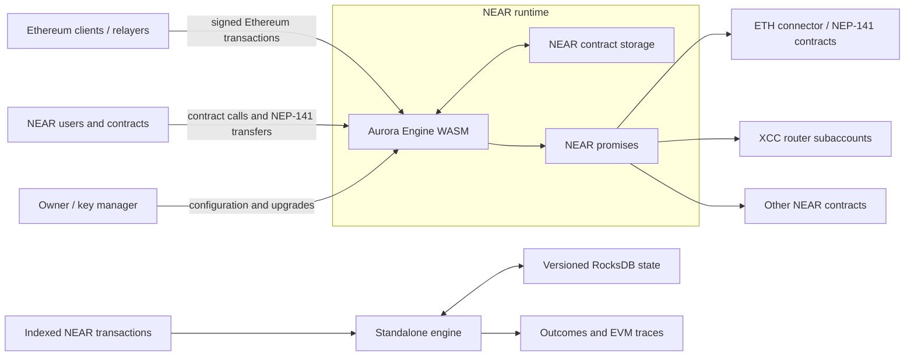
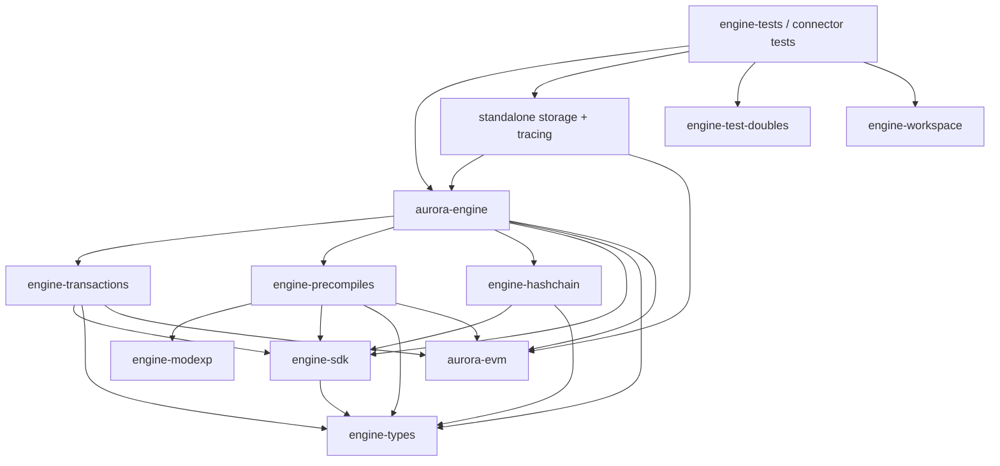

# Aurora Engine Architecture

## Purpose

Aurora Engine implements Ethereum execution as a smart contract on NEAR. It accepts Ethereum transactions and direct contract calls, executes them with Ethereum semantics, stores EVM state in NEAR contract storage, and translates selected EVM operations into NEAR promises.

The repository also provides a native replay path. The same engine logic can run against RocksDB and a supplied block context, allowing off-chain consumers to reproduce contract state and extract traces without executing the WASM contract.

The design is driven by four constraints:

1. EVM execution and gas behavior must be deterministic and compatible with the selected Ethereum hard fork.
2. Production code must fit a `no_std` WebAssembly contract and interact with NEAR only through host functions.
3. On-chain and standalone execution must share the same business logic.
4. Contract APIs, storage keys, and serialized values must remain backward compatible across upgrades.

## System context

The on-chain contract is authoritative. Standalone execution is a deterministic replay and inspection facility; it does not replace NEAR consensus or contract storage.

## Component model

The workspace is layered so that portable types and runtime traits sit below execution code, while native tools and tests sit above it.

The main responsibilities are:

| Component | Responsibility |
| --- | --- |
| [`engine`](engine/) | Contract entry points, authorization, EVM backend, state application, gas payment/refunds, connector logic, hashchain integration, and XCC coordination. |
| [`engine-types`](engine-types/) | Shared domain types, contract parameters, serialization formats, Ethereum numeric/address wrappers, and persistent storage-key construction. |
| [`engine-sdk`](engine-sdk/) | Abstract runtime interfaces and their NEAR host implementation, plus cryptographic and utility functions used by the engine. |
| [`engine-transactions`](engine-transactions/) | RLP decoding, signature recovery, normalization, and intrinsic/floor gas calculation for supported Ethereum transaction envelopes. |
| [`engine-precompiles`](engine-precompiles/) | Standard Ethereum cryptographic precompiles and Aurora-specific precompiles that expose NEAR context or request cross-contract actions. |
| [`engine-hashchain`](engine-hashchain/) | Optional per-transaction/per-block hashchain and log bloom accumulation. |
| [`engine-modexp`](engine-modexp/) | WASM-friendly modular exponentiation implementation used by the ModExp precompile. |
| [`engine-standalone-storage`](engine-standalone-storage/) | RocksDB-backed historical state, transaction metadata, snapshots, diffs, and an `IO` adapter for replay. |
| [`engine-standalone-tracing`](engine-standalone-tracing/) | Geth-like trace construction from `aurora-evm` tracing events. |
| [`engine-test-doubles`](engine-test-doubles/) | In-memory implementations of runtime abstractions for unit tests. |
| [`engine-workspace`](engine-workspace/) | Typed wrappers for deploying and calling the contract with NEAR sandbox. |
| [`engine-tests`](engine-tests/) | WASM, native, standalone-equivalence, Solidity integration, and gas/benchmark coverage. |

The contracts under [`etc/xcc-router`](etc/xcc-router/) and [`etc/tests`](etc/tests/) are separate Cargo projects rather than root workspace members. Solidity sources and embedded ERC-20 artifacts live under [`etc/eth-contracts`](etc/eth-contracts/).

## Runtime abstraction boundary

Production logic does not call NEAR host functions directly. Most code is generic over three traits from `engine-sdk`:

- `IO` reads method input, writes method output, and accesses key/value storage. Its `StorageIntermediate` type permits register-backed values to be copied lazily rather than eagerly allocated in WASM.
- `Env` supplies signer, predecessor, current account, block metadata, attached deposit, randomness, and gas information.
- `PromiseHandler` reads callback results and creates, combines, attaches, and returns NEAR promises. `ReadOnlyPromiseHandler` lets precompiles inspect results without gaining promise-creation authority.

[`engine-sdk/src/near_runtime.rs`](engine-sdk/src/near_runtime.rs) implements all three traits for the NEAR host ABI. Tests use fixed environments and in-memory IO. Standalone replay uses an `IO` implementation backed by a historical RocksDB view and an explicit `Env` value.

This boundary is what allows the functions in [`engine/src/contract_methods`](engine/src/contract_methods/) to be shared between the deployed contract and native execution.

## On-chain call flow

1. A `#[no_mangle]` export in [`engine/src/lib.rs`](engine/src/lib.rs) is invoked by NEAR. Exports are compiled only with the `contract` feature.
2. The export creates the zero-sized NEAR `Runtime` adapter and delegates to a generic function in `contract_methods`.
3. The contract method reads raw, Borsh, or JSON input as required, loads `EngineState`, applies pause and authorization checks, and constructs an `Engine` when EVM execution is needed.
4. The `Engine` acts as both the `aurora-evm` `Backend` and `ApplyBackend`. Reads are served from namespaced contract storage with per-execution caches.
5. `aurora-evm` executes with the configured hard-fork rules and the precompile set assembled by `engine-precompiles`.
6. The executor returns account/code/storage changes and logs. `ApplyBackend` persists changes, using checked balance accounting to prevent an unintended increase in ETH supply.
7. Aurora-specific internal logs are interpreted as trusted promise instructions. They are converted through `PromiseHandler` into NEAR calls/callbacks and removed from the user-visible EVM log list. Ordinary EVM logs remain in `SubmitResult`.
8. The result is serialized to the method output. Mutating calls wrapped by the hashchain layer also record the observed input, output, and log bloom when hashchain tracking is enabled.

The contract method layer intentionally returns `Result` rather than panicking. The thin export layer converts an error into the contract's established panic behavior with `sdk_unwrap`.

## Ethereum transaction pipeline

The `submit` and `submit_with_args` methods follow this path:

1. `engine-transactions` parses the EIP-2718 envelope and normalizes Legacy, EIP-2930, EIP-1559, or EIP-7702 fields into `NormalizedEthTransaction`. EIP-4844 is recognized but not executed.
2. Signature recovery determines the EVM sender. The engine validates access policy, chain ID, nonce, fee relationships, intrinsic gas, floor gas, and EIP-specific sender rules.
3. Gas payment is deducted before execution using the effective gas price or configured silo fixed-gas policy.
4. The engine dispatches to either EVM call or contract creation. Access lists and EIP-7702 authorizations are passed to `aurora-evm`.
5. The Prague EVM configuration and Prague precompile set are currently selected in [`engine/src/engine.rs`](engine/src/engine.rs). Precompiles can be filtered by stored pause flags.
6. State changes are applied, promise-producing logs are processed, and unused gas is refunded. The priority-fee portion is credited to the relayer address.

Standalone replay uses a block-height-aware compatibility transaction parser so historical transactions continue to reproduce the behavior of the contract version that originally processed them.

## State and persistence

### On-chain key space

[`engine-types/src/storage.rs`](engine-types/src/storage.rs) owns persistent key construction. Current keys begin with a storage-format version byte and a namespace byte (`KeyPrefix`), followed by the namespace-specific key material.

Major namespaces include configuration, nonce, balance, bytecode, EVM storage, address mappings, connector data, XCC data, hashchain state, silo settings, and whitelists. EVM account storage keys include the 20-byte address and 32-byte slot.

Contract storage cannot be enumerated cheaply. Clearing all storage for an EVM account therefore increments an account generation and writes future slots under that generation, making prior slots unreachable without scanning and deleting them.

### Engine configuration

`EngineState` contains the chain ID, owner, upgrade delay, pause state, and optional key manager. It is stored under the configuration namespace with a versioned Borsh representation. Deserialization accepts earlier layouts and performs the established lazy migration to the latest representation.

Adding a field is not a normal struct edit: it requires a new serialized version, conversion logic from older versions, and migration tests. The same caution applies to `KeyPrefix`, contract parameter enums, and any Borsh type stored on-chain or exchanged with callers.

### Standalone history

The standalone storage records block metadata, transaction positions, inputs, outputs, and per-transaction state diffs in RocksDB. An execution can run against state at a particular block and transaction position, produce an in-memory diff, and then either be inspected or committed. Deleted values remain representable in history so earlier states can be reconstructed.

This design supports deterministic replay, snapshot import/export, and comparison of native execution with the state produced by the WASM contract.

## NEAR interoperability

### Token connector

The connector layer maps NEP-141 account IDs to ERC-20 addresses, receives token transfers, deploys embedded ERC-20 bytecode, mints or burns the EVM representation, and schedules calls to the configured ETH connector or token contract. Standard NEP-141 entry points use their required JSON formats; internal Aurora parameters are generally Borsh encoded.

The bytecode embedded by the engine is generated from [`etc/eth-contracts/contracts`](etc/eth-contracts/contracts/) and committed under `etc/eth-contracts/res/`. The `error_refund` feature selects the ERC-20 variant that supports the corresponding refund behavior.

### Cross-contract calls

The XCC precompile lets EVM contracts request NEAR calls without exposing unrestricted access to the engine account. It emits a specially structured internal log; the engine recognizes that log, applies XCC funding/router rules, and schedules the permitted promise chain.

Router code and version mappings are managed by owner-controlled factory methods. Per-address router contracts are deployed under subaccounts of the engine account, with wNEAR configuration used for attached-value flows.

### Hashchain

Hashchain recording is optional and begins only after the administrative `start_hashchain` flow. `CachedIO` observes a call's input and output without changing the runtime implementation. The engine combines those values with method name and log bloom, accumulates transactions within the NEAR block height, and persists the current hashchain under its own storage namespace.

## Test architecture

The test suite exercises the same behavior at progressively wider boundaries:

| Layer | Main mechanism | Best suited for |
| --- | --- | --- |
| Crate unit tests | In-memory `IO`, fixed `Env`, and test promise handlers | Parsing, arithmetic, storage helpers, precompiles, and focused engine behavior. |
| `AuroraRunner` | Executes the compiled engine WASM through `near-vm-runner` with mocked external storage | Contract ABI, host behavior, gas profiling, and broad EVM integration tests. |
| `StandaloneRunner` | Runs shared engine methods against RocksDB-backed state | Replay behavior and equivalence with the WASM/native runner. |
| `engine-workspace` | Deploys contracts to a real NEAR sandbox through `near-workspaces` | Promises, callbacks, access keys, upgrades, connector flows, and multi-contract behavior. |
| Solidity fixtures | Compiles or loads Solidity contracts and drives them through Ethereum transactions | ERC-20, Uniswap, precompile, and application-level compatibility. |

Many `AuroraRunner` tests also maintain a standalone runner and compare resulting key/value state. This catches divergence between on-chain execution semantics and the replay path.

The canonical validation tasks and their prerequisites are documented in [`AGENTS.md`](AGENTS.md) and [`README.md`](README.md).

## Build and deployment shape

The root [`Makefile.toml`](Makefile.toml) orchestrates builds:

- `cargo make build` compiles Solidity artifacts, builds `aurora-engine` for `wasm32-unknown-unknown` with `--no-default-features --features contract`, and optimizes the result with `wasm-opt`.
- `cargo make build-test` adds the `integration-test` feature and creates the WASM used by integration tests.
- `cargo make build-xcc-router` builds the separate router contract.
- Docker tasks use the pinned contract-builder image to produce reproducible release binaries.

Release builds enable LTO, a single codegen unit, overflow checks, abort-on-panic, and symbol stripping. The production artifact is `bin/aurora-engine.wasm`.

## Change placement guide

- Add or change a NEAR entry point in `engine/src/lib.rs`, but keep its reusable implementation in the appropriate `engine/src/contract_methods/` module.
- Put contract inputs, outputs, and shared wire types in `engine-types`; explicitly decide whether their format is Borsh, JSON, RLP, or Ethereum ABI.
- Add runtime-dependent behavior through an `engine-sdk` abstraction rather than a direct host call in core execution code.
- Add transaction envelope parsing and normalization in `engine-transactions`, then integrate it into the engine's common validation pipeline.
- Implement a precompile in `engine-precompiles`, register it in the appropriate hard-fork constructor, and cover address, gas, output, and failure semantics.
- Put EVM account/state reads and writes behind the helpers in `engine/src/engine.rs` and the key constructors in `engine-types/src/storage.rs`.
- Update standalone message decoding and compatibility logic whenever an on-chain method or historical input format affects replay.
- Use `engine-tests` for behavior spanning crates or runtimes; use `engine-workspace` when actual NEAR receipts or callbacks are part of the behavior.

## Architectural invariants

- On-chain and standalone execution must produce equivalent EVM state for the same ordered inputs and environment.
- Only validated engine-owned encodings may cause the engine account to create privileged NEAR promises.
- Persistent keys and serialized layouts are append-only compatibility surfaces unless accompanied by an explicit migration.
- EVM state application must not create ETH except through an authorized mint/bridge path.
- Gas charging, refunding, and relayer rewards use checked arithmetic and must remain consistent across success, revert, and error paths.
- `no_std` support and explicit feature selection are part of the production architecture, not optional portability work.
- Public contract methods remain thin adapters; business logic stays testable through generic runtime traits.
